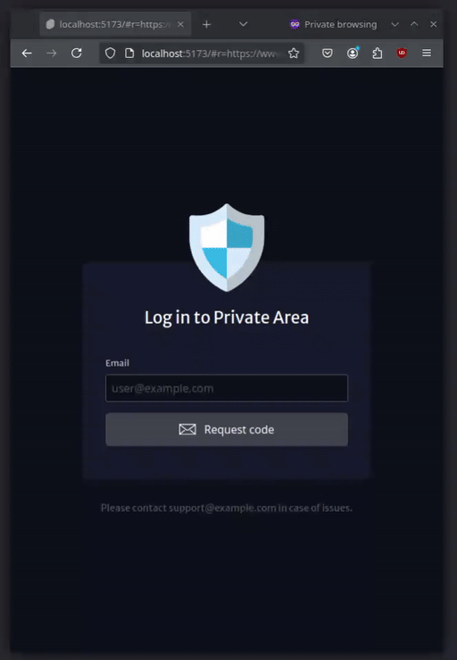

# Proxy Auth Gateway - Praga

Provide authentication capabilities for proxy environments, designed particularly for use with
Nginx `ngx_http_auth_request_module` module.

Allows Nginx to check all the requests are authenticated centrally before passing them on to less secure
services. Then if the user is unauthenticated they shall be required to log in via Praga. Praga provides the
capability for users to log in with an email verification code.



Depending on configuration of Praga and Nginx it should allow at least:

- Access control for an individual domain
- Access control for an individual path
- Access control for a domain and its subdomains

Currently supports sending emails via [Mailjet](https://www.mailjet.com), but integration to other services is
likely trivial.

Read more on `ngx_http_auth_request_module` usage at:

- https://nginx.org/en/docs/http/ngx_http_auth_request_module.html
- https://redbyte.eu/en/blog/using-the-nginx-auth-request-module/

TODO:

- Implement rate limits for email sending and code verification
- Limit redirect targets from configuration
- Better socket handling, to avoid needing wrapping in a shell script
- A method to reload the configuration without restarting the server e.g. via SIGHUP

You can check if your Nginx install supports the auth request module with:

```shell
nginx -V 2>&1 | grep --color=always http_auth_request
```

# Running

Build Praga first or get the prebuilt binary release, then ensure you have a `praga.yaml` configured and run:

```shell
./praga
```

or

```shell
./praga --config=path/to/praga.yaml
```

If you want to use a unix socket for connecting, ensure the path exists with the right permissions and that
you run `praga` as the correct user, like the same one Nginx is running as. You can check
e.g. [start-praga.sh](./start-praga.sh) for an example.

Check the [Nginx configuration example](./examples/nginx-simple) for
a [praga.yaml](./examples/nginx-simple/praga.yaml) and
[nginx site.conf](./examples/nginx-simple/nginx-site.conf) that can help you get started with setup.

See [praga.tpl.yaml](./praga.tpl.yaml) for information on what all things are configurable, key highlights:

- Valid email domains or individual email addresses for login
- Authentication token lifetime (defaults to 1 day)
- Customization of names and support information shown to users

In practice running Praga as a service can be done fairly easily:

1. `wget https://github.com/cocreators-ee/praga/releases/latest/download/praga-linux-amd64; chmod +x praga-linux-amd64; mv praga-linux-amd64 /usr/bin/praga`
2. Set up your `praga.yaml` in `/etc/praga.yaml`
3. Create [/start-praga.sh](./start-praga.sh) (remember `chmod +x`)
4. Create [/etc/systemd/system/praga.service](./praga.service)
5. `systemctl daemon-reload; systemctl enable --now praga`

# Examples

Check out the [examples](./examples) -folder for a couple of different examples of how to deploy Praga.

# Docker example

This is for example only, you *WILL* have to change the configuration for your own uses.

```shell
docker build . -f Dockerfile.nginx -t praga
docker run --rm -it --env MJ_APIKEY_PUBLIC=your-mailjet-public-key --env MJ_APIKEY_PRIVATE=your-mailjet-private-key -p 80:80 praga
```

This image depends on your `/etc/hosts` or `C:\Windows\System32\drivers\etc\hosts` containing the following:

```
127.0.0.1 my.domain
127.0.0.1 login.my.domain
```

This example also has no SSL configured, so you will get security warnings about accessing via HTTP. It does
not make a lot of sense to actually use praga to "secure" HTTP-based services, so ensure you set up SSL
correctly for your installs.

# Building

Prerequisites:

- [Golang](https://go.dev/doc/install) (tested on v1.23)
- [NodeJS](https://nodejs.org/en/download) (tested on v20.12.2)

```shell
pnpm -C frontend build
go mod download
go build cmd/praga/praga.go
```

Example of how to build in Docker is provided in [Dockerfile.nginx](./Dockerfile.nginx)

# Security

Praga tries to enforce some reasonable basic security configuration. It by default enables HTTP Strict
Transport Security, blocks frames, disables content type sniffing, and e.g. sets up a reasonably strict
Content Security Policy.

The API and frontend are kept intentionally simple, to limit chances and scope of meaningful vulnerabilities.
Does not depend on a database, so no SQL injections etc. are possible which also simplifies hosting. Once
built the `praga` binary is static and easy to ship, verify the SHA256 sum etc.

The email verification codes are generated by taking a SHA256-HMAC signature of a string containing the email
and the current timestamp rounded down to the latest 15 minutes, mixed with the unique signing key from the
configuration. The signature is then encoded to a set of 16 easily distinguishable characters (
2379HJKLNQSTVXYZ) to make an 8 character code with about 4 billion variations available.

# Development

Prerequisites:

- [Golang](https://go.dev/doc/install) (tested on v1.23)
- [NodeJS](https://nodejs.org/en/download) (tested on v20.12.2)
- [pre-commit](https://pre-commit.com/#install)

To prepare everything clone the repository and run:

```shell
pre-commit install
go mod tidy
pnpm -C frontend build
```

## Backend

Copy `praga.tpl.yaml` to `praga.yaml` and edit accordingly. Ensure it listens to http://localhost:8086 if you
want the default frontend API proxy to work.

You can then run the backend with:

```shell
go run cmd/praga/praga.go
```

You may want to flip the `debug` constant to `true` in `backend/server.go`.

The backend automatically tries to host the built frontend build results from `frontend/build` under `/`,
while API requests are expected under the `/api` -path.

Run unit tests with `go test ./backend`

## Frontend

```shell
cd frontend
pnpm run dev
```

Test with e.g. http://localhost:5173/#r=https://www.google.com/search?q=success

If you want to test it bundled into the binary, make sure you `pnpm run build` before starting the backend.

## Email

Open the [verification email template](./email/verification.mjml) in
an [MJML editor](https://mjml.io/try-it-live/), replace the contents with new ones, and run `pre-commit` to
generate the `.html` from it.

Then make sure you either restart the `go run` or rebuild the binary to re-embed the new version.

## Contributions

If you plan on contributing to the code ensure you use
[pre-commit](https://pre-commit.com/#install) to guarantee the code style stays uniform
etc.

Also, please open an issue first to discuss the idea before sending a PR so that you
know if it would be wanted or needs re-thinking or if you should just make a fork for
yourself.

## You guarantee the security of this, right?

No. You are responsible for and own your own things. This code is licensed under
the [BSD 3-clause license](LICENSE.md). If you don't trust it, don't run it.

# Financial support

This project has been made possible thanks to [Cocreators](https://cocreators.ee)
and [Lietu](https://lietu.net). You
can help us continue our open source work by supporting us
on [Buy me a coffee](https://www.buymeacoffee.com/cocreators)
.

[](https://www.buymeacoffee.com/cocreators)

# Attributions

The project is using the following resources:

- Photo by Christina
  Morillo: https://www.pexels.com/photo/woman-wearing-black-hoodie-jacket-holding-grey-laptop-computer-1181325/
- https://lottiefiles.com/free-animation/checkmark-EUqSK4A5c8
- https://lottiefiles.com/free-animation/material-wave-loading-yt2uoeE83o
- https://www.svgrepo.com/svg/243714/shield-antivirus
- https://www.svgrepo.com/svg/279586/fingerprint
- https://www.svgrepo.com/svg/392463/email-letter-mail-message-communication-office
